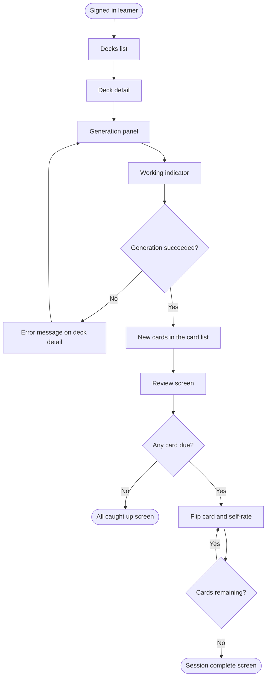
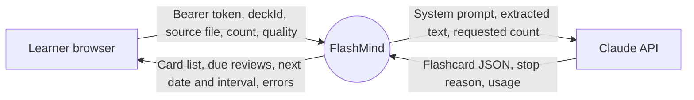
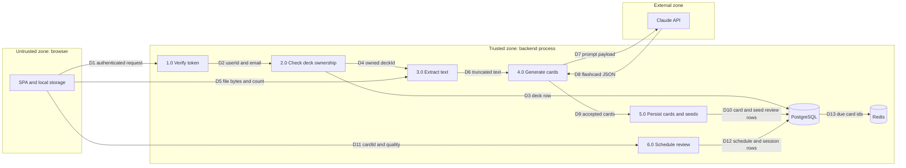
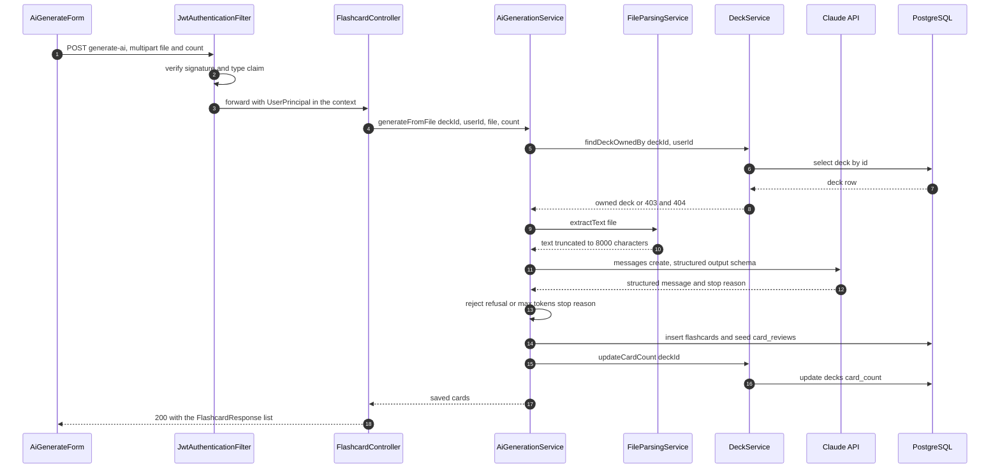
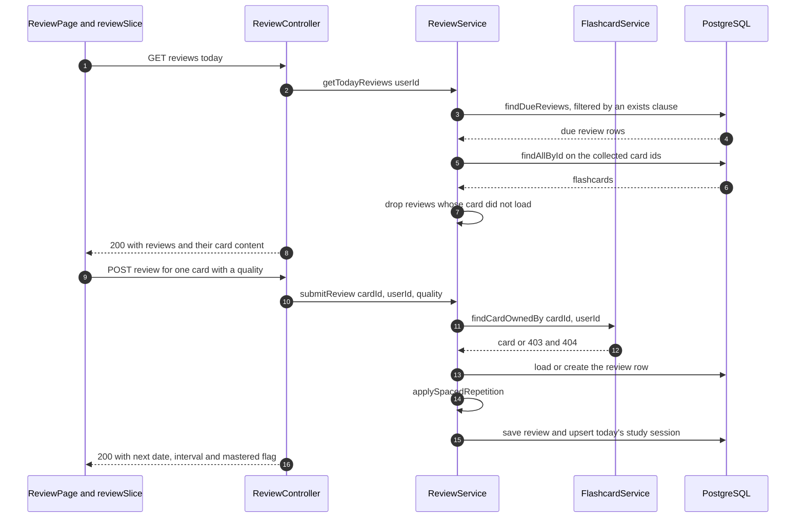
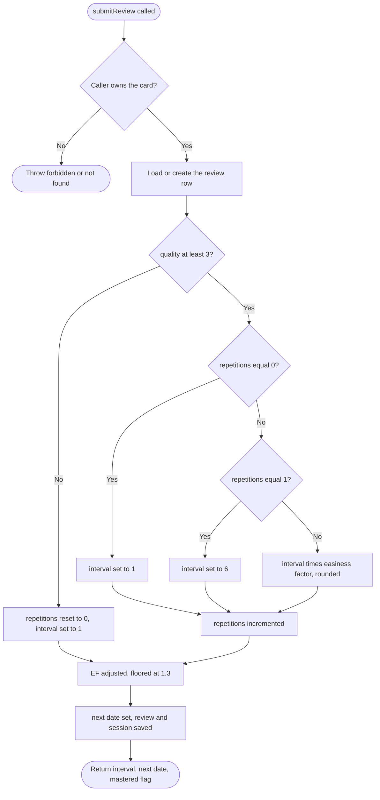
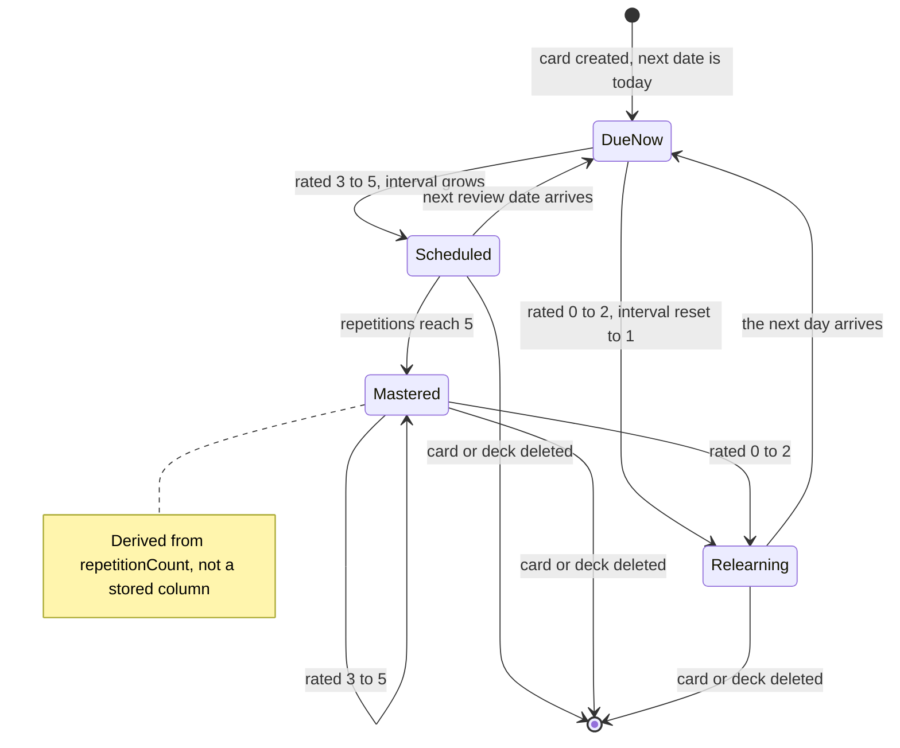

# Flows: from an uploaded document to a scheduled review

This document describes one scope — **turning an uploaded PDF or TXT into flashcards and
reviewing them on the SM-2 schedule** — across three separate layers of abstraction:

| Layer | Question it answers | Audience |
|-------|---------------------|----------|
| [1. User flow](#1-user-flow) | What does the learner *do*? | Product, QA |
| [2. Data flow](#2-data-flow) | Where does the data *go*? | Backend, security |
| [3. System / control flow](#3-system--control-flow) | In what order does the code *execute*? | Engineering |

Authentication is a **precondition** of this scope, not part of the user flow: it appears in the
data flow (token verification, credentials) and in the control flow (the filter chain), but the
learner is already signed in when section 1 starts.

Related: [architecture.md](architecture.md), [backend.md](backend.md),
[api-reference.md](api-reference.md), [data-model.md](data-model.md),
[spaced-repetition.md](spaced-repetition.md).

---

## 0. Overview

A signed-in learner opens one of their decks, uploads a PDF or TXT file and asks for a number of
flashcards. The backend extracts the text, sends it to Claude with a fixed system prompt and a
structured-output schema, stores every returned card together with a review row due today, and
returns the new cards to the browser. Later — the same day or any day after — the learner opens
the review screen, which lists every card whose next review date has arrived, flips each card and
rates their recall from 0 to 5. Each rating runs the SM-2 algorithm, rewrites the card's schedule
and increments that day's study-session counters, which the analytics screen reads back.

### Actors

| Actor | How it is identified | What it may do in this scope |
|-------|----------------------|------------------------------|
| Learner | JWT access token, `type = access`, carrying `userId` and `email` | Everything below, restricted to decks whose `userId` matches their own |
| Anonymous visitor | No token, or a token that fails verification | Nothing — every route in this scope is authenticated; the SPA redirects to `/login` |
| Claude API | Server-side API key, never exposed to the browser | Receives extracted text, returns flashcard JSON. Holds no account and no state |
| Scheduler | In-process Spring `@Scheduled` job, no user context | Caches due-card ids into Redis at 00:00, purges orphaned reviews at 03:00 |

There is **no admin role** and no role hierarchy anywhere in the codebase. Ownership is the only
authorization dimension.

### Assumptions

Each item is an assumption because the input was missing, not something the code states:

1. **Audience** is mixed product and engineering; the document is written so a product manager can
   read section 1 and stop there.
2. **Platform** is the web SPA only. There is no mobile client in the repository.
3. **The learner's device is a desktop browser.** The upload panel accepts a click or a drop, and
   nothing in the code is mobile-specific.
4. **The deck already exists** when the flow starts. Deck creation is a separate flow.
5. **"Today" means the backend server's local date.** Every schedule decision uses
   `LocalDate.now()` on the server; no user time zone is stored or applied.
6. **The SPA currently renders Vietnamese labels.** This document names the screens and messages
   in English, as documentation prose must be; the frontend is being migrated incrementally, so
   the on-screen wording will not match word for word.
7. **No SLA, no compliance regime and no rate-limit policy** were specified. The only limits
   documented here are the ones the code enforces.

### Glossary

| Term | Meaning |
|------|---------|
| Deck | A named collection of flashcards owned by exactly one learner |
| Card | A flashcard: front, back, optional hint |
| Review row | The per-learner, per-card schedule record (`card_reviews`), unique on `(card_id, user_id)` |
| Due | A review row whose `nextReviewDate` is today or in the past |
| Quality | The learner's self-rating of one recall attempt, an integer 0–5 |
| Interval | Days until the next review of that card |
| Easiness factor (EF) | SM-2 multiplier that grows the interval, floored at 1.3, starting at 2.5 |
| Mastered | A derived label, not a stored column: `repetitionCount >= 5` |
| Orphaned review | A review row whose card no longer exists — possible because the database has no foreign keys |
| Structured output | Claude returns JSON matching a schema derived from `GeneratedCards`, enforced server-side |

---

## 1. User flow

Contains no endpoint, table or function names by design.

### Preconditions

- The learner is signed in and the SPA holds a valid session.
- The learner owns at least one deck.
- The source document is a PDF or TXT file of at most 5 MB.

### Happy path

| # | Screen / route | Learner action | What the learner perceives | Success state |
|---|----------------|----------------|----------------------------|---------------|
| U1 | Decks list, `/decks` | Opens one deck | The deck's detail screen loads with its title, description, card count and existing cards | Deck detail visible |
| U2 | Deck detail, `/decks/:id` | Picks a PDF or TXT file in the generation panel | The chosen file name replaces the drop-zone prompt | A file is staged |
| U3 | Deck detail, `/decks/:id` | Drags the slider to set how many cards to generate | The number above the slider updates live, between 5 and 20 | A count is chosen |
| U4 | Deck detail, `/decks/:id` | Presses the generate button | The button becomes a disabled spinner labelled as working; the rest of the screen stays usable | Generation is running |
| U5 | Deck detail, `/decks/:id` | Waits | A success message names how many cards were created, and the new cards appear at the end of the card list | Cards are saved and visible |
| U6 | Review, `/review` | Opens the review screen | A progress bar and a counter reading `1 / N`, and the question side of the first card | A session has started |
| U7 | Review, `/review` | Clicks the card, optionally revealing the hint first | The card flips to the answer side and six rating buttons, 0 to 5, appear | The answer is visible |
| U8 | Review, `/review` | Presses one rating button | A confirmation panel replaces the card for about a second, stating in how many days the card returns and on which date | The rating is recorded |
| U9 | Review, `/review` | Repeats U7–U8 until the counter is exhausted | A completion screen states how many cards were reviewed and links back to the dashboard | The session is finished |

Cards created in U5 are due immediately, so the same day's session in U6 already contains them.

### Flowchart

### Alternate and failure paths

| Trigger | What the learner sees | Where they land |
|---------|-----------------------|-----------------|
| Chosen file is larger than 5 MB | A message that the file must be under 5 MB; the file is not staged and nothing is uploaded | Deck detail, panel unchanged |
| File is neither PDF nor TXT | A message that only PDF and TXT are supported | Deck detail, file still staged |
| File is empty or its text cannot be extracted | A message that the file is empty or unreadable | Deck detail, file still staged |
| The assistant declines the document's content | A message that the content was declined | Deck detail, file still staged |
| The assistant is overloaded | A message asking them to retry in a few minutes | Deck detail, file still staged |
| The generated answer is too long | A message asking them to request fewer cards | Deck detail, file still staged |
| Generation takes longer than two minutes, or the network fails | A generic generation-failed message | Deck detail, file still staged |
| The assistant returns nothing usable | A message that no flashcards were generated | Deck detail, file still staged |
| The deck was deleted, or belongs to someone else | A generic error message; no cards appear | Deck detail |
| The session expired and cannot be renewed | The app leaves the current screen and shows the sign-in screen | `/login` |
| No card is due | A confirmation that everything is reviewed, with a link back to the decks | Review screen, empty state |
| A rating cannot be submitted | A message that the rating failed; the same card stays on screen and can be rated again | Review screen, same card |

Generation is not resumable: after any failure the learner presses the button again, and every
successful attempt adds cards rather than replacing the previous attempt's.

### Postconditions

- The deck contains the newly generated cards, each flagged as AI-generated, and its card count
  matches the number of cards it holds.
- Every generated card is due on the day it was generated.
- Every rated card has a new interval, a new next review date and an updated recall history.
- The current day's study record counts one review per rating, and the ones rated 3 or higher
  separately as correct.

---

## 2. Data flow

Contains no screen names and no call ordering by design.

### 2.1 Context diagram (Level 0)

The Claude API is the only external system in this scope. PostgreSQL and Redis are internal
stores, decomposed in the Level 1 diagram below.

### 2.2 Level 1 DFD

Redis is written by the scheduler only and read by nothing — see 2.4.

### 2.3 Data dictionary

| Flow | Payload fields | Source | Destination | Transport | Synchronous |
|------|----------------|--------|-------------|-----------|-------------|
| D1 authenticated request | `Authorization: Bearer <jwt>` plus the request body | SPA | `JwtAuthenticationFilter` | HTTPS in production, HTTP through the Vite proxy in dev | Yes |
| D2 userId and email | `userId`, `email` | `JwtAuthenticationFilter` | `AuthHelper` → controller | In-process `SecurityContextHolder` | Yes |
| D3 deck row | `id`, `userId`, `title`, `description`, `language`, `cardCount`, `createdAt` | `decks` | `DeckService.findDeckOwnedBy` | JDBC / SQL | Yes |
| D4 owned deckId | `deckId`, `userId` | `DeckService` | `AiGenerationService` | In-process call | Yes |
| D5 file bytes and count | `file` (multipart), `count` (default 10) | SPA | `FlashcardController` | HTTP `multipart/form-data`, capped at 5 MB | Yes |
| D6 truncated text | Plain text, at most 8000 characters | `FileParsingService` | `AiGenerationService` | In-process string | Yes |
| D7 prompt payload | `model`, `max_tokens`, system prompt, user message containing `count` and the text, output schema | `AiGenerationService` | Claude API | HTTPS, Anthropic Java SDK, 120 s timeout | Yes — blocks the request thread |
| D8 flashcard JSON | `flashcards[]` of `{front, back, hint}`, `stopReason`, `stopDetails` | Claude API | `AiGenerationService` | HTTPS | Yes |
| D9 accepted cards | `front`, `back`, `hint` for the cards that survive validation | `AiGenerationService` | `FlashcardRepository` / `CardReviewRepository` | In-process call | Yes |
| D10 card and seed review rows | `flashcards` row plus a `card_reviews` row with `interval 0`, `EF 2.5`, `repetitionCount 0`, `nextReviewDate today` | Repositories | `flashcards`, `card_reviews`, `decks.card_count` | JDBC / SQL, one transaction | Yes |
| D11 cardId and quality | `cardId` in the path, `{quality: 0..5}` in the body | SPA | `ReviewController` | HTTPS, JSON | Yes |
| D12 schedule and session rows | `interval`, `easinessFactor`, `repetitionCount`, `nextReviewDate`, `lastReviewedAt`; `cardsReviewed`, `correctCount` | `ReviewService` | `card_reviews`, `study_sessions` | JDBC / SQL, one transaction | Yes |
| D13 due card ids | `due_cards:{userId}` → list of card ids, TTL 25 h | `SchedulerService` | Redis | RESP, `RedisTemplate` | Asynchronous, cron `0 0 0 * * *` |

### 2.4 Data stores

| Store | Written | Read | Retention | Source of truth for |
|-------|---------|------|-----------|---------------------|
| `decks` | On deck create/update, and `card_count` after every card insert or delete | Ownership checks, deck screens | Until the learner deletes the deck | Deck metadata and the denormalized card count |
| `flashcards` | On manual create, on AI generation, on edit | Deck detail, review payload assembly | Until the card or its deck is deleted | Card content |
| `card_reviews` | Seeded when a card is created, rewritten on every rating | Due-card query, mastery count | Until the card or deck is deleted, or the 03:00 orphan purge removes it | The SM-2 schedule |
| `study_sessions` | Incremented once per submitted rating | Analytics screen, streak calculation | Never deleted by any code path | Daily review counts |
| Redis `due_cards:{userId}` | Nightly by the scheduler | **Nothing** | 25 hours | Nothing — the cache is unfinished; the due-card endpoint always reads PostgreSQL |
| Browser local storage | On sign-in and on token refresh | Every outgoing request | Until sign-out or a failed refresh | The session |

The uploaded file itself is **never persisted**. It exists as request bytes and as an in-memory
string, and only the derived cards reach the database.

### 2.5 Transformations

| # | Input shape | Rule applied | Output shape |
|---|-------------|--------------|--------------|
| T1 | Bearer token string | HS256 signature check over the Base64-decoded secret, then `type = access` | `UserPrincipal(userId, email)`, or no authentication at all |
| T2 | Multipart file | Extension check; PDFBox text extraction for PDF, UTF-8 decode for TXT; reject blank text; truncate above 8000 characters | Plain text |
| T3 | Text plus requested count | Insertion into the fixed user-message template, alongside the static system prompt and the schema derived from `GeneratedCards` | Claude request parameters |
| T4 | Claude response | Reject a `refusal` or `max_tokens` stop reason; take the first structured text block | `GeneratedCards` record |
| T5 | `GeneratedCard` | Skip any card with a blank front or back; normalize a blank hint to `null`; force `isAiGenerated = true` | `flashcards` row |
| T6 | New card id and userId | Seed the schedule with `interval 0`, `EF 2.5`, `repetitionCount 0`, `nextReviewDate = today` | `card_reviews` row |
| T7 | Existing schedule plus a quality 0–5 | SM-2, detailed in [3.3](#33-sm-2-algorithm) | Updated `card_reviews` row |
| T8 | Today's session row plus one rating | `cardsReviewed + 1`, and `correctCount + 1` when `quality >= 3` | Updated `study_sessions` row |
| T9 | Due review rows plus their cards | Batch-load the cards by id, drop any review whose card did not load, zip the pairs | `CardReviewResponse[]` |
| T10 | 30 days of session rows | Fill missing days with zeros, sum the reviews, count schedules at or above 5 repetitions, walk backwards for the streak | `AnalyticsResponse` |

### 2.6 Sensitive data

| Data | Where it travels | Protection at each hop |
|------|------------------|------------------------|
| Password | Browser → `/api/auth/*` only | BCrypt-hashed before storage; never read back into any response |
| Access and refresh tokens | Browser local storage → `Authorization` header | Signed HS256, 1 h and 7 d lifetimes. **Readable by any script on the page** — local storage offers no XSS protection — and there is no revocation list, so a leaked refresh token stays valid for its full 7 days |
| Email and full name | Sign-in response, cached user object | Returned only to the owning session |
| Uploaded document content | Browser → backend memory → Claude API | Sent over TLS, truncated to 8000 characters, never written to disk or to the database. **Anything in the file leaves the deployment**, so a learner who uploads confidential material sends it to a third party |
| Claude API key | Environment variable → SDK client | Server-side only, never in a response and never in the SPA bundle |
| JWT signing secret | Environment variable | A development default is committed in `application.properties` and must be overridden in production |

---

## 3. System / control flow

Contains no screen names by design.

### 3.1 Generation path

Steps 4 to 17 all run inside the single transaction opened by `generateFromFile`, the Claude call
included — see [3.6](#36-transactions-idempotency-and-concurrency).

### 3.2 Review path

No message in either path is asynchronous or queued. The only background work is the two cron
jobs in [3.7](#37-background-jobs), which no request ever waits on.

### 3.3 SM-2 algorithm

`ReviewService.applySpacedRepetition` is the single source of truth for scheduling; the
algorithm itself is documented in [spaced-repetition.md](spaced-repetition.md).

The mastered flag in the response is computed as `repetitionCount >= 5`; nothing is stored.
`MASTERY_THRESHOLD = 5` is duplicated as a constant in both `ReviewService` and
`AnalyticsService`, so the two must be changed together.

### 3.4 Review row lifecycle

### 3.5 Error and exception handling

Two alternate paths in section 1 raise no exception at all: an empty due list is a normal `200`
with `[]`, and retrying a rating after a failed submission is simply a second request.

| Exception or condition | Where it is caught | Returned to the caller | Status | Section 1 failure row |
|------------------------|--------------------|------------------------|--------|-----------------------|
| Unsupported extension, blank text, unreadable PDF or TXT | Thrown by `FileParsingService`, handled by `GlobalExceptionHandler` | `{timestamp, status, message}` | 400 | Not PDF or TXT; empty file |
| `NotFoundException` from the SDK — the model id is wrong | `AiGenerationService.callClaude`, rethrown as `BusinessException` | Configuration error message | 400 | Generic generation failure |
| `RateLimitException` — Claude returned 429 | `AiGenerationService.callClaude`, rethrown as `BusinessException` | Retry-later message | 400 | Assistant overloaded |
| `AnthropicServiceException`, timeouts, any other exception from the call | `AiGenerationService.callClaude`, rethrown as `BusinessException` | Generation-failed message | 400 | Longer than two minutes; network failure |
| `stopReason = refusal` — HTTP 200 with empty content | Checked in `callClaude` before the content is read | Content-declined message | 400 | Assistant declines the content |
| `stopReason = max_tokens` | Checked in `callClaude` | Ask for fewer cards | 400 | Answer too long |
| Empty card list, or every card rejected for a blank front or back | `AiGenerationService.saveCards` | No-cards-generated message | 400 | Nothing usable returned |
| `ForbiddenException` — the deck belongs to another user | `DeckService.findDeckOwnedBy` → `GlobalExceptionHandler` | Access-denied message | 403 | Deck belongs to someone else |
| `ResourceNotFoundException` — the deck or card is gone | `DeckService` / `FlashcardService` → `GlobalExceptionHandler` | Not-found message | 404 | Deck deleted |
| `MethodArgumentNotValidException` — `quality` missing or outside 0–5 | `GlobalExceptionHandler` | Field-by-field message | 400 | Rating cannot be submitted |
| Invalid, expired or wrong-`type` token | Logged and swallowed by `JwtAuthenticationFilter`; the request continues unauthenticated and the filter chain rejects it | Spring Security's own body | 401 / 403 | Session expired |
| A 401 on any non-`/auth/` request | The SPA's axios response interceptor refreshes once, guarded by `_retry`, and replays the request; if the refresh fails it clears the tokens and hard-redirects | — | — | Session expired |
| `MaxUploadSizeExceededException` — a file above 5 MB reaches the server | **Not handled specifically**; falls through to the catch-all handler | Server-error message | 500 | Larger than 5 MB, when the client check is bypassed |
| Anything else | `GlobalExceptionHandler.handleGeneral`, logged | Server-error message | 500 | Generic error |

### 3.6 Transactions, idempotency and concurrency

| Concern | Where the boundary sits | Consequence |
|---------|-------------------------|-------------|
| Generation transaction | `AiGenerationService.generateFromFile` is `@Transactional`, and the Claude call happens inside it | A database transaction and its pooled connection stay open for up to the 120 s timeout. A failure after the call rolls every card back — but the Claude usage is still billed |
| Review transaction | `ReviewService.submitReview` is `@Transactional` | The schedule row and the study-session row commit together, or neither does |
| Deletion ordering | `DeckService.deleteDeck`, `FlashcardService.deleteCard` | The database has no foreign keys, so reviews must be purged before their cards; the order is load-bearing ([data-model.md](data-model.md)) |
| Idempotency of generation | None. There is no request key and no deduplication | Pressing generate twice creates two full sets of cards. The button is disabled while a request is in flight, which is the only protection |
| Idempotency of a rating | None. Every submission recomputes SM-2 from the current row | Rating the same card twice advances the schedule twice and counts two reviews in the day's statistics |
| Concurrent ratings of one card | `card_reviews` is unique on `(card_id, user_id)`, but the service does a read-then-write | Two simultaneous submissions can both miss the existing row and race on the insert; the loser gets a constraint violation surfaced as 500 |
| Concurrent ratings on one day | `study_sessions` is unique on `(user_id, session_date)`, also read-then-write | Same race, plus a possible lost counter increment |
| Rate limiting | None in the application | The only limiter is Claude's own, seen as 429 and mapped to a 400 |
| Request size | `spring.servlet.multipart.max-file-size = 5MB` | Enforced by Spring before the controller runs |

### 3.7 Background jobs

| Job | Cron | What it does | Read by |
|-----|------|--------------|---------|
| `SchedulerService.cacheDailyDueCards` | `0 0 0 * * *` | Writes `due_cards:{userId}` with a 25 h TTL for every user with due cards | Nothing |
| `SchedulerService.cleanupOrphanedReviews` | `0 0 3 * * *` | Deletes review rows whose card no longer exists | — |

---

## 4. Cross-layer traceability matrix

| User step | API call or event | Data entities touched | Code module | Failure mode |
|-----------|-------------------|-----------------------|-------------|--------------|
| U1 Open a deck | `GET /api/decks/{id}` and `GET /api/decks/{id}/cards` | `decks`, `flashcards` | `DeckController` → `DeckService`; `FlashcardController` → `FlashcardService` | 403 or 404 on a deck the caller does not own; the screen shows a load error |
| U2 Stage a file | None — purely client-side | None | `AiGenerateForm.handleFileChange` | Above 5 MB the file is rejected before any request |
| U3 Choose a count | None — purely client-side | None | `AiGenerateForm` slider, range 5 to 20 | The range is a UI constraint only; the endpoint accepts any integer |
| U4 Press generate | `POST /api/decks/{deckId}/generate-ai` | `decks` read for ownership | `FlashcardController.generateFromAi` → `AiGenerationService` | 403 or 404 on ownership; 500 if a file above 5 MB reaches the server |
| U5 Cards appear | The response of the same call | `flashcards`, `card_reviews`, `decks.card_count` | `FileParsingService`, Claude API, `FlashcardRepository`, `CardReviewRepository`, `DeckService.updateCardCount` | Every 400 in [3.5](#35-error-and-exception-handling); nothing is saved, the transaction rolls back |
| U6 Open the review screen | `GET /api/reviews/today` | `card_reviews`, `flashcards` | `ReviewController` → `ReviewService.getTodayReviews` | 401 triggers one silent refresh, then a redirect; an empty list renders the caught-up state |
| U7 Flip a card | None — purely client-side | None | `ReviewCard` component state | The card is skipped entirely if its content is missing |
| U8 Rate the card | `POST /api/reviews/{cardId}` | `card_reviews`, `study_sessions` | `ReviewController` → `ReviewService.submitReview` → `applySpacedRepetition` | 400 on a quality outside 0–5; 403 or 404 on ownership; 500 on a concurrent-write race |
| U9 Finish the session | None — the index advances locally | None | `reviewSlice.nextCard` | The list is not refetched, so cards deleted in another tab stay in the session |

---

## 5. Edge cases, risks and open questions

### Handled edge cases

| Case | Behaviour |
|------|-----------|
| A review row survives its card | Four layers block it: the due query filters with an `exists` clause, the service drops reviews whose card did not load, the 03:00 job purges them, and the SPA filters a null card as well |
| Claude declines the content | The response is HTTP 200 with empty content, so `stopReason` is checked before the content is read |
| The model returns a card with a blank front or back | That card is skipped; if every card is skipped the request fails rather than reporting success with nothing saved |
| The model returns a blank hint | Stored as `null`, keeping the existing convention |
| Extracted text is very long | Truncated to 8000 characters, capping token spend and bounding the request |
| The learner has not studied yet today | The streak counts from yesterday instead of breaking |
| A day has no study session | Analytics fills the gap with zeros across the whole 30-day window |
| A token expires mid-session | The axios interceptor refreshes exactly once per request, never for `/auth/*` URLs, and redirects if that fails |

### Risks found while writing this document

1. **The Claude call runs inside a database transaction.** `generateFromFile` holds a connection
   for up to 120 s. Under concurrent generation this exhausts the pool long before Claude becomes
   the bottleneck.
2. **A file above 5 MB returns 500, not 400.** `MaxUploadSizeExceededException` has no handler.
   The browser check hides this, but any direct API caller sees a server error.
3. **`count` is unvalidated server-side.** The endpoint accepts any integer and interpolates it
   straight into the prompt; only the slider keeps it between 5 and 20.
4. **Nothing is idempotent.** A retried generation duplicates cards; a re-submitted rating
   advances the schedule twice and double-counts the day's statistics.
5. **Two read-then-write races.** Concurrent submissions can violate the unique constraints on
   `card_reviews` and `study_sessions`, surfacing as a 500.
6. **"Today" is the server's date.** A learner several time zones away sees cards become due at
   the wrong local moment, and their streak can break while they believe they studied.
7. **Redis costs without paying back.** The nightly job writes a key nothing reads. It is either
   an unfinished feature or dead code.
8. **Tokens sit in local storage with no revocation.** Any XSS reads them, and a stolen refresh
   token remains valid for its full seven days because nothing tracks issued tokens.
9. **Uploaded content leaves the deployment** and nothing in the interface says so.
10. **Documentation drift.** [api-reference.md](api-reference.md) still states that error messages
    are returned in Vietnamese and shows a Vietnamese example, while the backend now returns
    English; `SchedulerService.cacheDailyDueCards` still logs one Vietnamese line.
11. **Neither list endpoint paginates.** A learner with thousands of due cards receives all of
    them, with their content, in one response.

### Open questions

1. Should `count` be capped server-side at 20 to match the slider? (yes / no)
2. Should the Claude call move outside the transaction, so cards are persisted in a short
   transaction after the call returns? (yes / no)
3. Should a file above 5 MB return 400 instead of 500? (yes / no)
4. Should "due today" follow the learner's time zone rather than the server's? (yes / no)
5. Should Redis become the real read path for the due-card endpoint, or should the nightly job be
   deleted? (read path / delete)
6. What is the intended maximum for the 8000-character truncation — keep it, or raise it to a
   specific number? (one value)
7. Should the generation panel tell the learner that the file's content is sent to a third-party
   model? (yes / no)
8. Should submitting a rating twice for the same card on the same day be rejected? (yes / no)
